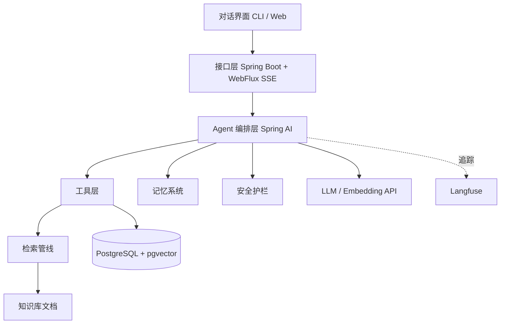

# SelfCoach 技术文档

- 版本：v0.1　|　日期：2026-09-08　|　状态：草案

## 1. 技术选型与理由

| 层 | 选型 | 理由 |
|---|---|---|
| 语言 | Java 17 | 作者主栈；Java 市场急需「懂大模型的 Java 后端」 |
| 框架 | Spring Boot 3 + WebFlux | 响应式支持 SSE 流式；主流工程底座 |
| LLM / Agent | Spring AI（备选 LangChain4j） | 与 Spring 生态无缝；原生支持 tool calling |
| 数据库 | PostgreSQL 16 + pgvector | 一个库同时管结构化 + 向量，减少组件 |
| 全文检索 | Lucene | BM25 业界级实现，Java 原生，比 Python 侧更强 |
| 分词 | HanLP 或 IK Analyzer | 中文分词 |
| Embedding | API（Qwen Embedding 等）→ 进阶 Python 侧车 bge-m3 | 纯 Java 起步；模型部分独立成服务 |
| Rerank | 相似度阈值 + LLM 精排 → 进阶 rerank 模型 | 渐进增强 |
| 可观测 | Langfuse（Java SDK） | 追踪 + 成本 + 评测集 |
| 部署 | Docker + docker-compose | 一键起 |

## 2. 系统架构



分层职责：

- **接口层**：接收对话，SSE 流式返回；前端保持极简。
- **编排层**：决定「要不要调用工具、调用哪个工具、如何组织多步」；Spring AI 的 Tool Calling 负责。
- **工具层**：查询训练日志、写日志、计算配重 / 热量、生成计划、做检索——每个工具独立可测。
- **数据层**：PostgreSQL 管结构化（用户 / 计划 / 日志），pgvector 管向量（知识库分块 + 语义记忆）。
- **横切**：安全护栏（请求进入与回答输出都要过）、Langfuse 追踪（全程埋点）。

## 3. 项目结构（规划）

```
selfcoach/
├── README.md
├── docs/                 # 需求 / 技术 / 计划
├── docker-compose.yml    # postgres + langfuse
├── pom.xml
└── src/main/java/com/selfcoach/
    ├── api/              # Controller（SSE）
    ├── llm/              # 模型接入抽象（统一 OpenAI 兼容接口）
    ├── orchestration/    # Agent 编排（Spring AI tool calling）
    ├── tools/            # 各工具实现
    ├── rag/
    │   ├── ingestion/    # 文档解析、切分、向量化
    │   ├── retrieval/    # 混合检索（Lucene BM25 + 向量）+ rerank
    │   └── citation/     # 引用溯源
    ├── memory/           # 结构化 / 语义 / 摘要记忆
    ├── guardrail/        # 安全护栏
    ├── observability/    # Langfuse 埋点封装
    ├── domain/           # 实体、Repository
    └── eval/             # 评估脚本与 golden 集
```

## 4. 核心流程设计

### 4.1 RAG 检索管线（手写核心区）
1. **入库**：文档解析（文本 / Markdown 起步）→ 分块（按段落 + 标题，中文友好）→ 生成 Embedding → 写入 pgvector；同时用 Lucene 建 BM25 倒排索引。
2. **检索**：查询并行走「向量检索 + BM25 关键词检索」→ 结果融合（融合分数 / RRF）→ 重排 → 取 Top-K。
3. **生成**：Top-K 拼入提示词，要求模型「受限回答 + 标注来源」，输出时附引用编号与出处。

### 4.2 Agent 编排
- 用户消息进入编排层 → 判断意图（问答 / 记录 / 计划 / 复盘）→ 选择并调用工具 → 多步结果组合 → 生成最终回答。
- 工具调用失败自动重试一次；连续失败则降级为「明确告知无法完成」。
- 敏感/高风险动作（生成极端计划）走护栏二次校验。

### 4.3 记忆系统（差异化核心）
- **结构化记忆**（PostgreSQL 表）：用户档案、训练日志、身体指标、伤病记录。
- **语义记忆**（pgvector）：历史对话与知识片段，用于「我之前说过什么」的召回。
- **摘要记忆**：定期把长周期进度 / 长对话压缩成摘要，作为「长期画像」注入提示词，控制上下文成本。

### 4.4 安全护栏
- 输入侧：医疗 / 伤病类问题识别 → 拒答并引导就医。
- 输出侧：检测极端节食 / 危险动作建议 → 拦截替换为安全提示。
- 敏感数据：身体数据不进入第三方日志，Langfuse 埋点前脱敏。

### 4.5 可观测与评估
- Langfuse 埋点：每次请求的输入、检索结果、工具调用、token 成本、延迟。
- 离线评估：维护 golden 数据集，跑「检索 recall@5」「回答正确率」「拒答准确率」回归。
- 产品指标：计划完成率、连续打卡天数、体重 / 力量趋势。

## 5. 数据模型（核心表）

| 表 | 关键字段 |
|---|---|
| user_profile | id, 目标(增肌/减脂/力量), 每周可用天数, 身高, 伤病标签 |
| training_log | id, user_id, 日期, 动作, 重量, 次数, 组数 |
| body_metric | id, user_id, 日期, 体重, 围度 |
| plan / plan_item | 计划头 + 每日动作明细 |
| doc_chunk | id, doc_id, 文本, embedding(vector), 来源 |
| memory_summary | id, user_id, 摘要文本, 更新时间 |

## 6. 接口设计（核心）
- `POST /api/chat`（SSE 流式）：对话主入口。
- `POST /api/training-logs`；`GET /api/training-logs`：训练记录。
- `GET /api/metrics/weight`：体重趋势。
- `POST /api/plan/generate`：生成训练计划。
- 认证：P0 阶段单用户，暂且不做登录；P2 加 JWT。

## 7. 部署方案
- `docker-compose.yml` 起 PostgreSQL(+pgvector) 与 Langfuse。
- 应用打包成 Docker 镜像；LLM / Embedding 走外部 API，密钥走环境变量。
- 本地开发用 `mvn spring-boot:run`。

## 8. 演进路线
P0 结构化 + RAG 最小闭环 → P1 工具调用 / 计划生成 → P2 记忆 → P3 安全 + 评估 + 可观测 → P4 多用户、看板、上线打磨。详见《开发计划》。